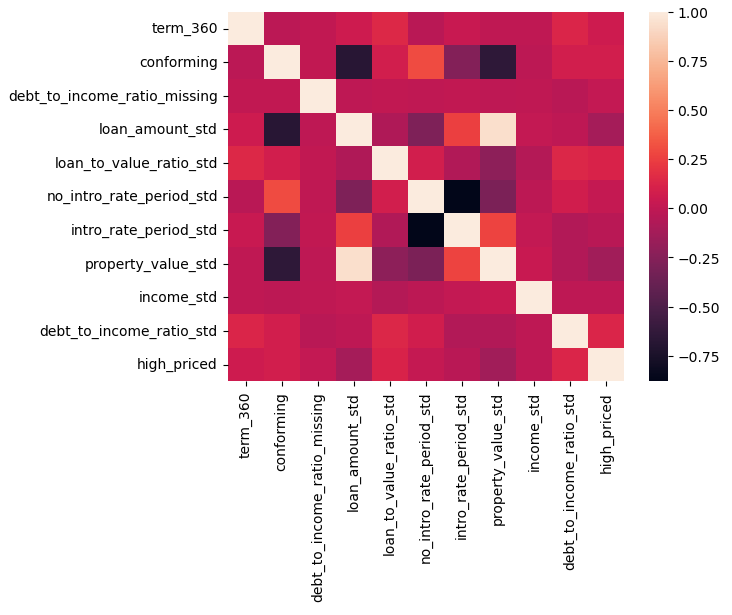
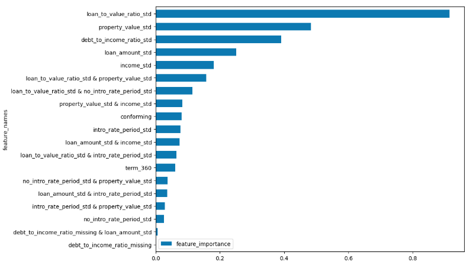

# Credit Line Increase Model Card

### Basic Information
* **Person or organization developing model**:  
  Patrick Hall, `jphall@gwu.edu`  
  Bethel Mandizha, `bethel.mandizha@gwmail.gwu.edu`  
  Miranda Montenegro, `miranda.montenegrolopez@gwmail.gwu.edu`  
  Rahul Saha, `rahul.saha@gwmail.gwu.edu`  
  Zeyu Wang, `zywang@gwu.edu`

* **Model date**: April 2025  
* **Model version**: 1.0  
* **License**: MIT  
* **Model implementation code**: [DNSC_6330_Project.ipynb](https://github.com/xxxxxx.ipynb)

### Intended Use
* **Primary intended uses**: This model is an *example* probability of default classifier, with an *example* use case for determining eligibility for a credit line increase.
* **Primary intended users**: Students in GWU DNSC 6301 bootcamp.
* **Out-of-scope use cases**: Any use beyond an educational example is out-of-scope.

### Training Data

* Data dictionary: 

| Name | Modeling Role | Measurement Level| Description|
| ---- | ------------- | ---------------- | ---------- |
|**ID**| ID | int | unique row indentifier |
| **LIMIT_BAL** | input | float | amount of previously awarded credit |
| **SEX** | demographic information | int | 1 = male; 2 = female
| **RACE** | demographic information | int | 1 = hispanic; 2 = black; 3 = white; 4 = asian |
| **EDUCATION** | demographic information | int | 1 = graduate school; 2 = university; 3 = high school; 4 = others |
| **MARRIAGE** | demographic information | int | 1 = married; 2 = single; 3 = others |
| **AGE** | demographic information | int | age in years |
| **PAY_0, PAY_2 - PAY_6** | inputs | int | history of past payment; PAY_0 = the repayment status in September, 2005; PAY_2 = the repayment status in August, 2005; ...; PAY_6 = the repayment status in April, 2005. The measurement scale for the repayment status is: -1 = pay duly; 1 = payment delay for one month; 2 = payment delay for two months; ...; 8 = payment delay for eight months; 9 = payment delay for nine months and above |
| **BILL_AMT1 - BILL_AMT6** | inputs | float | amount of bill statement; BILL_AMNT1 = amount of bill statement in September, 2005; BILL_AMT2 = amount of bill statement in August, 2005; ...; BILL_AMT6 = amount of bill statement in April, 2005 |
| **PAY_AMT1 - PAY_AMT6** | inputs | float | amount of previous payment; PAY_AMT1 = amount paid in September, 2005; PAY_AMT2 = amount paid in August, 2005; ...; PAY_AMT6 = amount paid in April, 2005 |
| **DELINQ_NEXT**| target | int | whether a customer's next payment is delinquent (late), 1 = late; 0 = on-time |

* **Source of training data**: GWU Blackboard, email `jphall@gwu.edu` for more information
* **How training data was divided into training and validation data**: 50% training, 25% validation, 25% test
* **Number of rows in training and validation data**:
  * Training rows: 15,000
  * Validation rows: 7,500

### Test Data
* **Source of test data**: GWU Blackboard, email `jphall@gwu.edu` for more information
* **Number of rows in test data**: 7,500
* **State any differences in columns between training and test data**: None

### Model details
* **Columns used as inputs in the final model**: 'LIMIT_BAL',
       'PAY_0', 'PAY_2', 'PAY_3', 'PAY_4', 'PAY_5', 'PAY_6', 'BILL_AMT1',
       'BILL_AMT2', 'BILL_AMT3', 'BILL_AMT4', 'BILL_AMT5', 'BILL_AMT6',
       'PAY_AMT1', 'PAY_AMT2', 'PAY_AMT3', 'PAY_AMT4', 'PAY_AMT5', 'PAY_AMT6'
* **Column(s) used as target(s) in the final model**: 'DELINQ_NEXT'
* **Type of model**: Decision Tree 
* **Software used to implement the model**: Python, scikit-learn
* **Version of the modeling software**: 0.22.2.post1
* **Hyperparameters or other settings of your model**: 
```
DecisionTreeClassifier(ccp_alpha=0.0, class_weight=None, criterion='gini',
                       max_depth=6, max_features=None, max_leaf_nodes=None,
                       min_impurity_decrease=0.0, min_impurity_split=None,
                       min_samples_leaf=1, min_samples_split=2,
                       min_weight_fraction_leaf=0.0, presort='deprecated',
                       random_state=12345, splitter='best')
```
### Quantitative Analysis

#### State the metrics used to evaluate your group’s best remediated model
- Models were assessed primarily with AUC and AIR. See details below:

| Train AUC | Validation AUC | Test AUC |
| --------- | -------------- | -------- |
| [value missing] | [value missing] | [value missing] |

**Table X.** AUC values across data partitions. 

| Group               | Validation AIR |
| ------------------- | -------------- |
| Black vs. White      | [value missing] |
| Hispanic vs. White   | [value missing] |
| Asian vs. White      | [value missing] |
| Female vs. Male      | [value missing] |

**Table X.** Validation AIR values for race and sex groups. 

(**HINT**: Test AUC taken from [evaluation rsesults here](https://github.com/jphall663/GWU_rml/blob/master/assignments/model_eval_2023_06_21_12_52_47.csv))


#### Correlation Heatmap


**Table X.** Correlation heatmap of input features. 

---

#### Global Variable Importance (Assignment 2)

  
**Table X.** Global feature importance of the final remediated EBM model.

---

#### Partial Dependence Plots (Assignment 2)

  
**Table X.** Partial dependence of debt-to-income ratio.

---

#### Fairness Comparison Plot (Assignment 3)

  
**Table X.** AIR before and after remediation for each group.

---

#### Red Teaming (Assignment 4)

| Type  | term_360 | debt_to_income_ratio_missing | intro_rate_period_std | property_value_std | income_std | debt_to_income_ratio_std |
|-------|----------|------------------------------|-----------------------|---------------------|------------|--------------------------|
| Low   | 0.89     | 0.00                         | 4.37                  | 0.11                | 46.23      | 1.04                     |
| High  | 0.92     | 1.00                         | 1.08                  | -0.70               | -2.49      | 0.38                     |

**Table X.** Seed Rows for Adversarial Example Search Using Stolen Model


| Type  | term_360 | debt_to_income_ratio_missing | intro_rate_period_std | property_value_std | income_std | debt_to_income_ratio_std | phat    |
|-------|----------|------------------------------|-----------------------|---------------------|------------|--------------------------|---------|
| Low   | 0.00     | 0.00                         | 9.09                  | 18.14               | 46.23      | -1.34                    | 7.41e-08|
| High  | 1.00     | 1.00                         | 0.02                  | -4.95               | -2.49      | 3.34                     | 0.91    |

**Table X.** Performance Degradation Under Perturbed Inputs (Adversarial Examples)

---

#### Debugging and Residuals (Assignment 5)

  
**Table X.** Residuals across subgroups for the remediated model.

---


