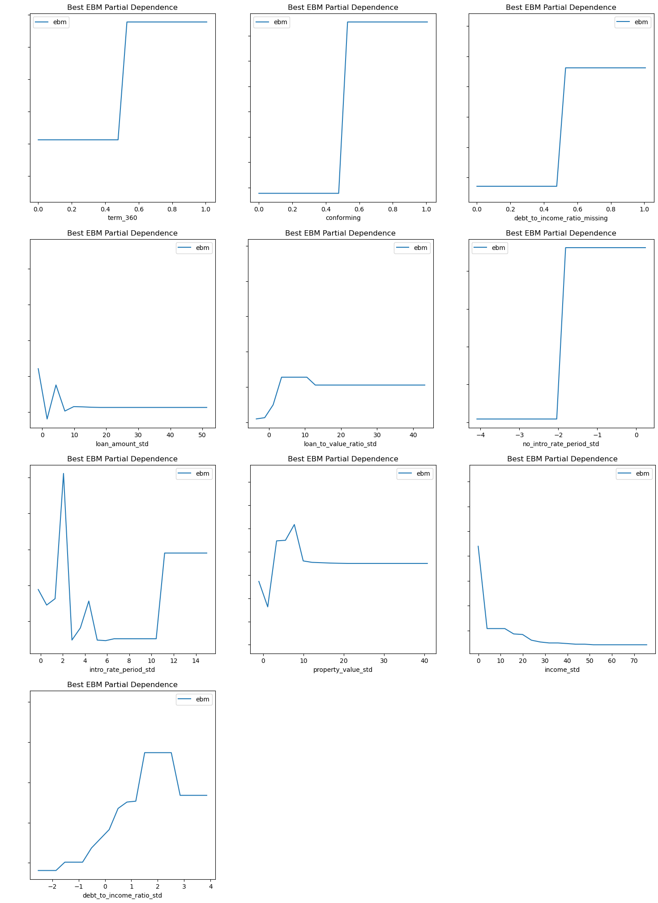
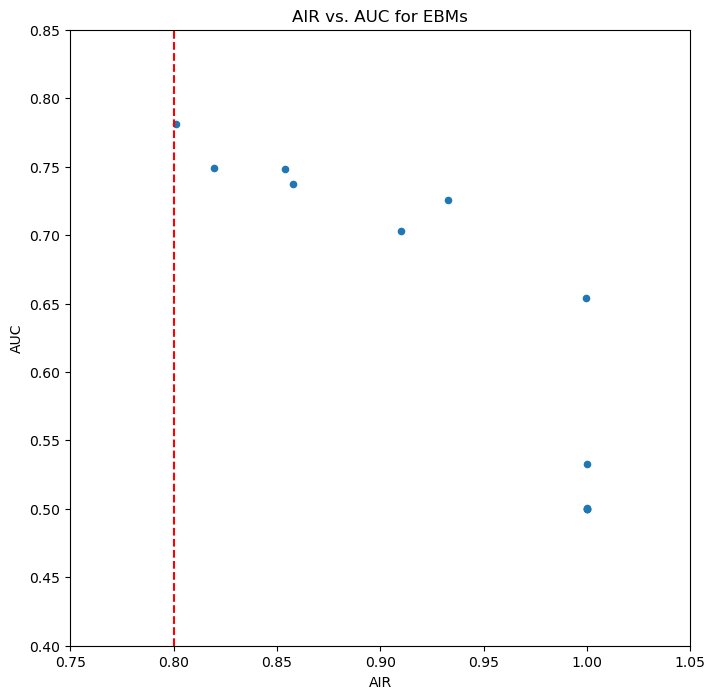
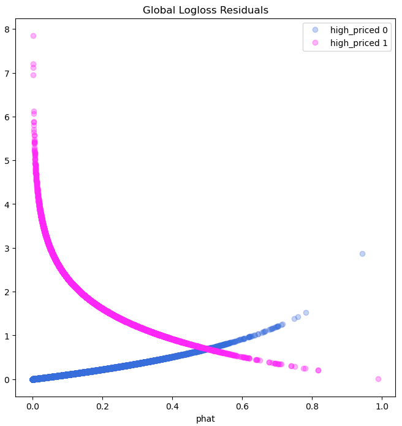
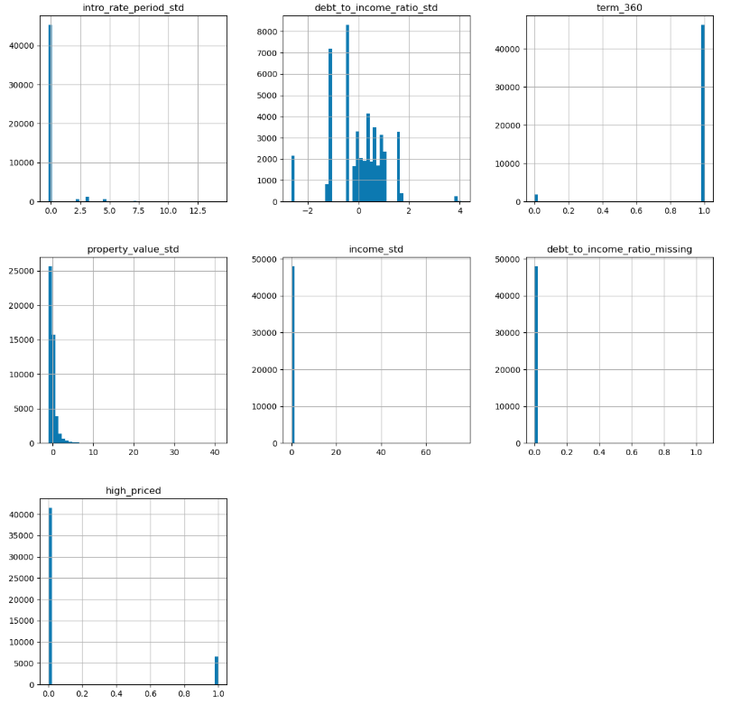

# 📝 Model Card: Lending Bias-Remediated Model

## Basic Information
* **Person or organization developing model**:  
  Patrick Hall - `jphall@gwu.edu`  
  Bethel Mandizha - `bethel.mandizha@gwmail.gwu.edu`  
  Miranda Montenegro - `miranda.montenegrolopez@gwmail.gwu.edu`  
  Rahul Saha - `rahul.saha@gwmail.gwu.edu`  
  Zeyu Wang - `zywang@gwu.edu`

* **Model date**: May, 2025 
* **Model version**: 1.0  
* **License**: Apache License, Version 2.0
* **Model implementation code**: [Group 3_Model.ipynb]([https://github.com/mmontenegro25/ResponsibleML/blob/main/Assignment%205/group3_assignment5_updated.ipynb])

## Intended Use
* **Describe the business value of your group’s best remediated model**: Our group's best remediated model assists mortgage lenders in making more equitable decisions about loan pricing by predicting whether a loan is high-priced, while minimizing demographic biases across race, gender, and age categories.
  
* **Describe how your group’s best remediated model is designed to be used**: The model predicts whether an applicant would receive a high-priced loan, allowing the lender to monitor disparities, detect potential fairness violations, and adjust practices to promote compliance and equity.
  
* **Describe the intended users for your group’s best remediated model**: Mortgage risk analysts, compliance officers, fair lending auditors, and regulatory reporting teams.
  
* **State whether your group’s best remediated model can or cannot be used for any additional purposes**: This model should not be used for final loan approval decisions, criminal justice predictions, insurance assessments, or employment-related evaluations without retraining and thorough validation for new use cases

## Training Data

* **Source of training data**: Preprocessed historical mortgage lending records from the Home Mortgage Disclosure Act (HMDA) datasets.
* **Training data and validation data split**: Of the 180,169 data points, 70% was assigned to the training data and 30% to the validation data. 
* **Number of rows in training and validation data**:
  * <u>Training data</u>: 160,338 rows
  * <u>Validation data</u>: 19,831 rows

* **Data dictionary**: 

| Name | Modeling Role | Measurement Level| Description|
| ---- | ------------- | ---------------- | ---------- |
|**conforming**| input | binary | whether the mortgage conforms to normal standards (1), or whether the loan is different (0), e.g., jumbo, HELOC, reverse mortgage, etc. |
| **debt_to_income_ratio_std** | input | numeric | standardized debt-to-income ratio for mortgage applicants |
| **debt_to_income_ratio_missing** | input | binary | missing marker (1) for debt to income ratio std. |
| **income_std** | input | numeric | standardized income for mortgage applicants |
| **loan_amount_std** | input | numeric | standardized amount of the mortgage for applicants |
| **intro_rate_std** | input | numeric |  standardized introductory rate period for mortgage applicants |
| **loan_to_value_ratio_std** | input | numeric | ratio of the mortgage size to the value of the property for mortgage applicants |
| **no_intro_rate_period_std** | input | binary | whether or not a mortgage does not include an introductory rate period |
| **property_value_std** | input | numeric | value of the mortgaged property |
| **term_360** | input | binary | whether the mortgage is a standard 360 month mortgage (1) or a different type of mortgage (0) |
| **high_priced**| engineered | binary | whether (1) or not (0) the annual percentage rate (APR) charged for a mortgage is
150 basis points (1.5%) or more above a survey-based estimate of similar mortgages |


### Test Data
* **Source of test data**: GWU Blackboard, email `jphall@gwu.edu` for more information
* **Number of rows in test data**: 7,500
* **State any differences in columns between training and test data**: None

### Model details
* **Columns used as inputs in the final model**: 'LIMIT_BAL',
       'PAY_0', 'PAY_2', 'PAY_3', 'PAY_4', 'PAY_5', 'PAY_6', 'BILL_AMT1',
       'BILL_AMT2', 'BILL_AMT3', 'BILL_AMT4', 'BILL_AMT5', 'BILL_AMT6',
       'PAY_AMT1', 'PAY_AMT2', 'PAY_AMT3', 'PAY_AMT4', 'PAY_AMT5', 'PAY_AMT6'
* **Column(s) used as target(s) in the final model**: 'DELINQ_NEXT'
* **Type of model**: Decision Tree 
* **Software used to implement the model**: Python, scikit-learn
* **Version of the modeling software**: 0.22.2.post1
* **Hyperparameters or other settings of your model**: 
```
DecisionTreeClassifier(ccp_alpha=0.0, class_weight=None, criterion='gini',
                       max_depth=6, max_features=None, max_leaf_nodes=None,
                       min_impurity_decrease=0.0, min_impurity_split=None,
                       min_samples_leaf=1, min_samples_split=2,
                       min_weight_fraction_leaf=0.0, presort='deprecated',
                       random_state=12345, splitter='best')
```
### Quantitative Analysis

#### State the metrics used to evaluate your group’s best remediated model
- We evaluated our best remediated model using AUC for predictive performance and AIR for fairness across demographic groups, selecting a model that balances accuracy with improved equity.

- Models were assessed primarily with AUC and AIR. See details below:

| Train AUC | Validation AUC | Test AUC |
| --------- | -------------- | -------- |
| 0.8305 | 0.8254 | 0.8298 |

**Table X.** AUC values across data partitions. 


| Group               | Validation AIR |
| ------------------- | -------------- |
| Black vs. White      | 0.791 |
| Asian vs. White      | 1.154 |
| Female vs. Male      | 0.962 |

**Table X.** Validation AIR values for race and sex groups. 

(**HINT**: Test AUC taken from [evaluation results here](https://github.com/mmontenegro25/ResponsibleML/blob/main/Assignment%203/group3_assignment3_higherAUC.ipynb))


#### Correlation Heatmap

- This heatmap shows how input features relate to one another, helping identify redundancy or strong dependencies between variables.


**Figure X.** Correlation Heatmap of Input Features. 

---

#### Global Variable Importance

- The EBM’s global feature importance highlights which variables most influenced predictions.

  

**Figure X.** Global Feature Importance of the Remediated EBM Model.

---

#### Partial Dependence Plots

- These plots illustrate how individual features impact the model’s predictions.

  

**Figure X.** Partial Dependence Plots by Features.

---

#### Fairness Comparison Plot

- This plot visualizes the trade-off between AUC and AIR across candidate models.

  

**Figure X.** Relationship Between AIR and AUC for Grid Search Results.

---

#### Red Teaming 

- Adversarial examples were used to probe model robustness, revealing inputs that cause prediction degradation and exposing vulnerabilities.

| Type  | term_360 | debt_to_income_ratio_missing | intro_rate_period_std | property_value_std | income_std | debt_to_income_ratio_std |
|-------|----------|------------------------------|-----------------------|---------------------|------------|--------------------------|
| Low   | 0.89     | 0.00                         | 4.37                  | 0.11                | 46.23      | 1.04                     |
| High  | 0.92     | 1.00                         | 1.08                  | -0.70               | -2.49      | 0.38                     |

**Table X.** Seed Rows for Adversarial Example Search Using Stolen Model

| Type  | term_360 | debt_to_income_ratio_missing | intro_rate_period_std | property_value_std | income_std | debt_to_income_ratio_std | phat    |
|-------|----------|------------------------------|-----------------------|---------------------|------------|--------------------------|---------|
| Low   | 0.00     | 0.00                         | 9.09                  | 18.14               | 46.23      | -1.34                    | 7.41e-08|
| High  | 1.00     | 1.00                         | 0.02                  | -4.95               | -2.49      | 3.34                     | 0.91    |

**Table X.** Performance Degradation Under Perturbed Inputs (Adversarial Examples)

---

#### Debugging and Residuals

- Residual and simulation plots expose subgroup errors and model shifts under economic stress.

  

**Figure X.** Residuals Across Subgroups for the Remediated Model.

  

**Figure X.** Feature Changes Under Simulated Recession Conditions.

---


