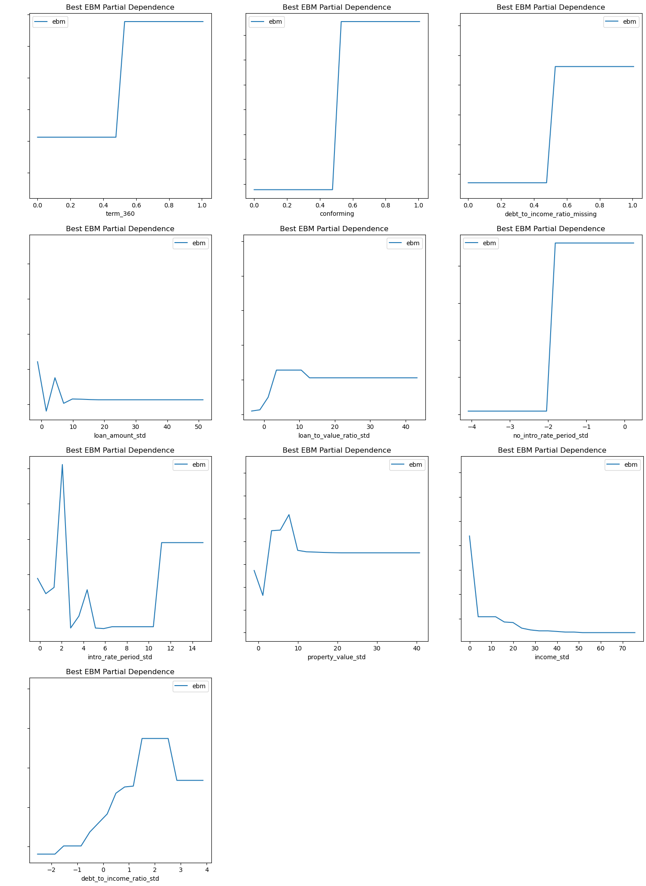
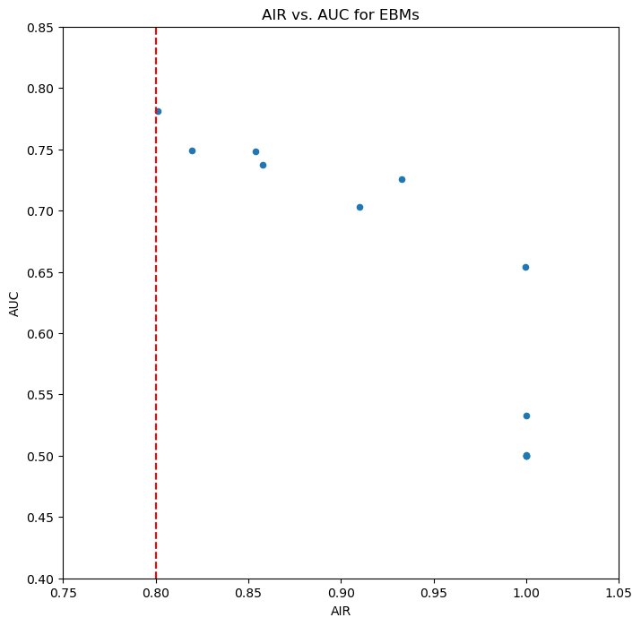
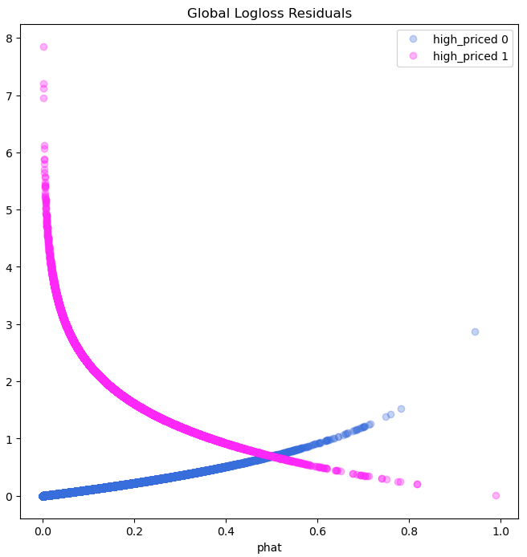
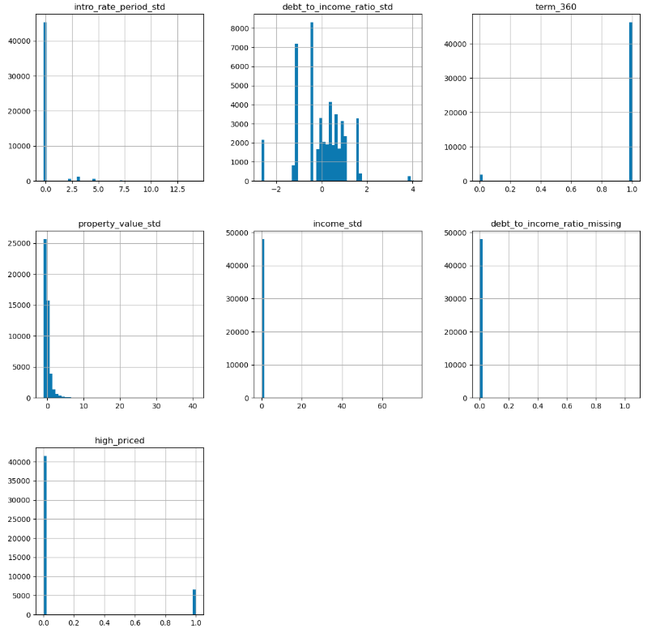

# 📝 Model Card: Lending Bias-Remediated Model

## Basic Information
* **Person or organization developing model**:
  * Patrick Hall - `jphall@gwu.edu`
  * Bethel Mandizha - `bethel.mandizha@gwmail.gwu.edu`
  * Miranda Montenegro - `miranda.montenegrolopez@gwmail.gwu.edu`
  * Rahul Saha - `rahul.saha@gwmail.gwu.edu`
  * Zeyu Wang - `zywang@gwu.edu`

* **Model date**: May, 2025 
* **Model version**: 1.0  
* **License**: Apache License, Version 2.0
* **Model implementation code**: [Group 3_Model.ipynb](https://github.com/mmontenegro25/ResponsibleML/blob/main/Assignment%205/group3_assignment5_updated.ipynb)

## 📌 Intended Use
* **Describe the business value of your group’s best remediated model**: Our group's best remediated model assists mortgage lenders in making more equitable decisions about loan pricing by predicting whether a loan is high-priced, while minimizing demographic biases across race, gender, and age categories.
  
* **Describe how your group’s best remediated model is designed to be used**: The model predicts whether an applicant would receive a high-priced loan, allowing the lender to monitor disparities, detect potential fairness violations, and adjust practices to promote compliance and equity.
  
* **Describe the intended users for your group’s best remediated model**: Mortgage risk analysts, compliance officers, fair lending auditors, and regulatory reporting teams.
  
* **State whether your group’s best remediated model can or cannot be used for any additional purposes**: This model should not be used for final loan approval decisions, criminal justice predictions, insurance assessments, or employment-related evaluations without retraining and thorough validation for new use cases

## ⚙️ Training Data

* **Source of training data**: Historical mortgage lending records from the Home Mortgage Disclosure Act (HMDA) datasets.
* **Training data and validation data split**: Of the 180,169 data points, 70% was assigned to the training data and 30% to the validation data. 
* **Number of rows in training and validation data**:
  * Training data: 160,338 rows.
  * Validation data: 19,831 rows.

* **Table 1. Data dictionary**

| Name | Modeling Role | Measurement Level| Description|
| ---- | ------------- | ---------------- | ---------- |
|**row_ID**| ID | integer | unique row indentifier |
| **black** | demographic information | float | whether the mortage holder identifies as black (1.0) or not (0.0); contains null values |
| **asian** | demographic information | float | whether the mortage holder identifies as asian (1.0) or not (0.0); contains null values |
| **white** | demographic information | float | whether the mortage holder identifies as white (1.0) or not (0.0); contains null values |
| **amind** | demographic information | float | whether the mortage holder identifies as American Indian (1.0) or not (0.0); contains null values |
| **hipac** | demographic information | float | whether the mortage holder identifies as Native Hawaiian or Other Pacific Islander (1.0) or not (0.0); contains null values |
| **hispanic** | demographic information | float | whether the mortage holder identifies as hispanic (1.0) or not (0.0); contains null values |
| **non_hispanic** | demographic information | float | whether the mortage holder identifies as non-hispanic (1.0) or not (0.0); contains null values |
| **male** | demographic information | float | whether the mortage holder identifies as male (1.0) or not (0.0); contains null values |
| **female** | demographic information | float | whether the mortage holder identifies as female (1.0) or not (0.0); contains null values |
| **agete62** | demographic information | float | whether the mortage holder's age is greater than or equal to 62(1.0) or not (0.0); contains null values |
| **agelt62** | demographic information | float | whether the mortage holder's age is less than 62 (1.0) or not (0.0); contains null values |
|**conforming**| input | binary | whether the mortgage conforms to normal standards (1), or whether the loan is different (0), e.g., jumbo, HELOC, reverse mortgage, etc. |
| **debt_to_income_ratio_std** | input | numeric | standardized debt-to-income ratio for mortgage applicants |
| **debt_to_income_ratio_missing** | input | binary | missing marker (1) for debt to income ratio std. |
| **income_std** | input | numeric | standardized income for mortgage applicants |
| **loan_amount_std** | input | numeric | standardized amount of the mortgage for applicants |
| **intro_rate_std** | input | numeric |  standardized introductory rate period for mortgage applicants |
| **loan_to_value_ratio_std** | input | numeric | ratio of the mortgage size to the value of the property for mortgage applicants |
| **no_intro_rate_period_std** | input | binary | whether or not a mortgage does not include an introductory rate period |
| **property_value_std** | input | numeric | value of the mortgaged property |
| **term_360** | input | binary | whether the mortgage is a standard 360 month mortgage (1) or a different type of mortgage (0) |
| **high_priced**| engineered | binary | whether (1) or not (0) the annual percentage rate (APR) charged for a mortgage is 150 basis points (1.5%) or more above a survey-based estimate of similar mortgages |

## ⚙️ Evaluation Data
* **Source of test data**: Historical mortgage lending records from the Home Mortgage Disclosure Act (HMDA) datasets.
* **Number of rows in test data**: 19,831 rows.
* **State any differences in columns between training and test data**: Evaluation or “test” data contains one additional column titled “High Priced”. This is a binary target where 1 or 0 indicate whether the APR charged for the mortgage is 1.5% or more. 

## 🔍 Model details
* **Columns used as inputs in the final model**:'intro_rate_period_std', 'debt_to_income_ratio_std', 'term_360', 'property_value_std', 'income_std', and 'debt_to_income_ratio_missing'.
* **Column(s) used as target(s) in the final model**: 'high_priced'.
* **Type of model**: Explainable Boosting Machine (EBM).
* **Software used to implement the model**: Python and the 'interpret' package. Specifically using 'interpret'’s class ExplainableBoostingClassifier. 
* **Version of the modeling software**:'interpret' version 0.6.9.
* **Hyperparameters or other settings of your model**:

**Table 2. Hyperparameters Used in the EBM Model**

| Hyperparameter | Value | 
| ---- | ------------- |
| **'max_bins'** | 1024 |
| **'max_interaction_bins'** | 24 | 
| **'interactions'** | 5 | 
| **'outer_bags'** | 8 | 
| **'inner_bags'** | 0 | 
| **'learning_rate'** | 0.01 | 
| **'validation_size'** | 0.05 |
| **'min_samples_leaf'** | 1 |
| **'max_leaves'** | 5 | 
| **'early_stopping_rounds'** | 100 |
| **'n_jobs'** | 4 |
| **'random_state'** | 12345 | 

## 🧠 Quantitative Analysis

#### State the metrics used to evaluate your group’s best remediated model:
- We evaluated our best remediated model using AUC for predictive performance and AIR for fairness across demographic groups, selecting a model that balances accuracy with improved equity.

- Models were assessed primarily with AUC and AIR. See details below:

**Table 3. AUC Values Across Data Partitions** 

| Train AUC | Validation AUC | Test AUC |
| --------- | -------------- | -------- |
| 0.8305 **UPDATE!!** | 0.8254 **UPDATE!!** | 0.7960 |

**NOTE**:
 * Train AUC and Validation AUC values from [this notebook] **UPDATE!!**
  * Validation values detailed in cell 67 with the following code - **UPDATE!!**
   * best_ebm_train = ROC(best_ebm_no_grid.predict_proba).explain_perf(train[features], train[target])
   * print('Train AUC: %.4f.' % best_ebm_train._internal_obj['overall']['auc'])
   * best_ebm_perf = ROC(best_ebm_no_grid.predict_proba).explain_perf(valid[features], valid[target])
   * print('Validation AUC: %.4f.' % best_ebm_perf._internal_obj['overall']['auc'])
     
 * Test AUC taken from Professor Hall's [evaluation results](https://github.com/jphall663/GWU_rml/blob/master/assignments/model_eval_2025_04_14_10_28_13.csv).

**Table 4 Validation AIR Values for Race and Sex Groups**

| Group               | Validation AIR |
| ------------------- | -------------- |
| Asian vs. White      | 1.124 |
| Black vs. White      | 0.826 |
| Female vs. Male      | 0.967 |

**NOTE**:
 * Validation AIR values taken from cell 183 in [this notebook](https://github.com/mmontenegro25/ResponsibleML/blob/main/Assignment%203/group3_assignment3_higherAUC.ipynb).

#### Correlation Heatmap

- This heatmap shows how input features relate to one another, helping identify redundancy or strong dependencies between variables:

**Figure 1. Correlation Heatmap of Input Features**

---

#### Global Variable Importance

- The EBM’s global feature importance highlights which variables most influenced predictions:

**Figure 2. Global Feature Importance of the Remediated EBM Model**
  

---

#### Partial Dependence Plots

- These plots illustrate how individual features impact the model’s predictions:

**Figure 3. Partial Dependence Plots by Features**
  

---

#### Fairness Comparison Plot

- This plot visualizes the trade-off between AUC and AIR across candidate models.
  
**Figure 4. Relationship Between AIR and AUC for Grid Search Results**
  

---

#### Red Teaming 

- Adversarial examples were used to probe model robustness, revealing inputs that cause prediction degradation and exposing vulnerabilities. Below please find further information regarding the adversarial examples: 

**Table 5. Seed Rows for Adversarial Example Search Using Stolen Model**

| Type  | term_360 | debt_to_income_ratio_missing | intro_rate_period_std | property_value_std | income_std | debt_to_income_ratio_std |
|-------|----------|------------------------------|-----------------------|---------------------|------------|--------------------------|
| Low   | 0.89     | 0.00                         | 4.37                  | 0.11                | 46.23      | 1.04                     |
| High  | 0.92     | 1.00                         | 1.08                  | -0.70               | -2.49      | 0.38                     |

**Table 6. Performance Degradation Under Perturbed Inputs (Adversarial Examples)**

| Type  | term_360 | debt_to_income_ratio_missing | intro_rate_period_std | property_value_std | income_std | debt_to_income_ratio_std | phat    |
|-------|----------|------------------------------|-----------------------|---------------------|------------|--------------------------|---------|
| Low   | 0.00     | 0.00                         | 9.09                  | 18.14               | 46.23      | -1.34                    | 7.41e-08|
| High  | 1.00     | 1.00                         | 0.02                  | -4.95               | -2.49      | 3.34                     | 0.91    |

---

#### Debugging and Residuals

* Residual and simulation plots expose subgroup errors and model shifts under economic stress:

**Figure 5. Residuals Across Subgroups for the Remediated Model**
  

**Figure 6. Feature Changes Under Simulated Recession Conditions**
  

**Other Alternative Models Considered**:
* **Elastic Net**: Achieved a validation AUC of 0.7538, offering good interpretability but struggling with non-linear relationships compared to other models.
* **Monotonic Gradient Boosting Machines (MGBM)**: With a validation AUC of 0.7945, it performed better but was more complex and less interpretable than the EBM, making it less ideal.

---

## 🧾 Ethical Considerations 

* **Potential Negative Impacts of Using Our Group’s Best Remediated Model**: We used explainable boosting machine (EBM) and logistic regression (GLM) for our remediated model. Here we identified a few possible risks in the model’s math and software implementation. First, if the input data contains outliers or missing values that were not handled during preprocessing, predictions might be unreliable. Also, since we used the 'interpret' package and EBM, any future updates in the software version could affect reproducibility or compatibility of results.

* **Real-World Risks (Who, What, When, How)**: Our model is designed to predict whether a loan is high-priced to support fairness monitoring. However, if the model is used beyond this purpose such as for loan approval or rejection decisions it could unintentionally harm applicants. Errors or biases could especially affect minority groups, leading to unfair outcomes if the model is deployed without human oversight or further validation.

* **Potential Uncertainties Relating to the Impacts of the Model**: We observed that the Asian vs. White AIR = 1.154, which suggests a slight over-correction favoring Asian applicants. It is uncertain whether this result fully reflects fairness or introduces a new imbalance. Small changes in model parameters or training data could lead to different fairness metrics.

* **Real-World Risks (Who, What, When, How)**: There is uncertainty about how the model’s fairness metrics would hold up if applied to new data or under different lending environments. If used without continuous monitoring, the model might miss new unfair patterns that could hurt underrepresented groups.

* **Unexpected Results Encountered During Training**: We noticed that the AIR for Asian vs. White was above 1.0 (1.154), which was unexpected because we aimed for parity across groups. This indicates that our remediation process may have slightly favored one group. We also found that some features had lower-than-expected variable importance, suggesting that certain predictors contributed less to the model than anticipated.

